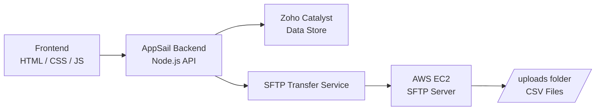

# 🚚 Logistics Prototype App (B2B Integration)


---

## 📌 Overview

The **Logistics Prototype App** is a **B2B shipment processing system** that demonstrates real-world enterprise integration using:

* 🌐 **Zoho Catalyst** (Frontend + Backend via AppSail)
* ☁️ **AWS EC2 (Ubuntu)** for SFTP server
* 📦 **File-based integration (CSV over SFTP)**

### 💡 What it does

1. User submits shipment details via web form
2. Backend generates tracking number
3. Shipment stored in Catalyst Data Store
4. Data exported as **CSV file to SFTP server**
5. External systems can retrieve and process shipments

---

## 🏗️ System Architecture



---

## 📁 Project Structure

```bash
logistics-prototype-project/
│
├── appsail-nodejs/
│   ├── routes/
│   │   ├── shipment.js
│   │   └── sftp.js
│   ├── index.js
│   ├── Dockerfile
│   └── package.json
│
├── client/
│   ├── index.html
│   ├── app.js
│   └── style.css
│
├── catalyst.json
├── app-config.json
└── README.md
```

---

## 🚀 Deployment

### 🔹 Zoho Catalyst (Frontend + Backend)

```bash
catalyst init
catalyst deploy
```

* Frontend: `index.html`, `style.css`, `app.js`
* Backend: AppSail Node.js service

---

### 🔹 AWS EC2 (SFTP Server)

Instance: `logistics-sftp-server`
OS: Ubuntu

#### Setup

```bash
sudo apt update
sudo apt install openssh-server -y

sudo adduser sftpuser
sudo mkdir -p /home/sftpuser/uploads

sudo chown root:root /home/sftpuser
sudo chmod 755 /home/sftpuser

sudo chown sftpuser:sftpuser /home/sftpuser/uploads
```

---

### 🔐 SSH Configuration

```bash
sudo nano /etc/ssh/sshd_config
```

```conf
Subsystem sftp internal-sftp

Match User sftpuser
    ChrootDirectory /home/sftpuser
    ForceCommand internal-sftp
    X11Forwarding no
    AllowTcpForwarding no
    PasswordAuthentication yes
```

```bash
sudo systemctl restart ssh
```

---

## 🔑 Environment Variables (AppSail)

```env
SFTP_HOST=35.178.204.42
SFTP_PORT=22
SFTP_USER=sftpuser
SFTP_PASSWORD=your-password
SFTP_REMOTE_DIR=/uploads
```

---

## 📤 File Output

Files are generated as **CSV** and uploaded to:

```bash
/home/sftpuser/uploads
```

Example:

```text
shipment_TRK-12345.csv
```

### Sample CSV

```csv
trackingNumber,rowId,senderName,senderEmail,origin,recipientName,recipientAddress,destination,weightKg,shipmentType,status,generatedAt
"TRK-123","2664","Adeniyi","test@mail.com","Exeter","Abimbola","11 Powlesland road","London","1.2","Standard","PENDING","2026-04-02"
```

---

## 🧪 Testing

### API Health Check

```bash
GET /api/health
```

### SFTP Test

```bash
sftp sftpuser@<EC2-IP>
```

---

## ⚠️ Challenges & Solutions

### 🔴 1. Authentication Failed

```text
Permission denied (publickey)
```

✅ Fixed by:

* Enabling password authentication
* Updating `sshd_config`

---

### 🔴 2. AppSail Env Variables Not Detected

```text
SFTP_PASSWORD is required
```

✅ Fixed by:

* Adding variables in AppSail dashboard
* Restarting service

---

### 🔴 3. SFTP Connection Failure

```text
All configured authentication methods failed
```

✅ Fixed by:

* Resetting EC2 password
* Matching AppSail credentials

---

### 🔴 4. File Not Uploaded

```text
Wrong directory path
```

✅ Fixed:

```env
SFTP_REMOTE_DIR=/uploads
```

---

### 🔴 5. SSH Lockout

```text
This service allows sftp connections only
```

✅ Fixed:

* Used `Match User` instead of global restriction

---

## 🛠️ Troubleshooting Commands

```bash
# Validate SSH config
sudo sshd -t

# Check SSH runtime config
sudo sshd -T

# Monitor login issues
sudo tail -f /var/log/auth.log

# View uploaded files
ls -lh /home/sftpuser/uploads

# Debug SFTP
sftp -v sftpuser@<IP>
```

---

## 📈 Future Enhancements

* 📂 File lifecycle management (`uploads`, `processed`, `failed`)
* 🔐 SSH key authentication
* 🔁 Retry mechanism for failed transfers
* 🤖 Automated file processor
* 📊 Dashboard for shipment tracking
* ☁️ Terraform automation for AWS infrastructure

---

## 🎯 Key Takeaways

This project demonstrates:

* Real-world **B2B integration pattern**
* Secure file transfer using SFTP
* Backend-to-external system communication
* Cloud deployment across multiple platforms

---

## 👨‍💻 Author

**Adeniyi**

---


